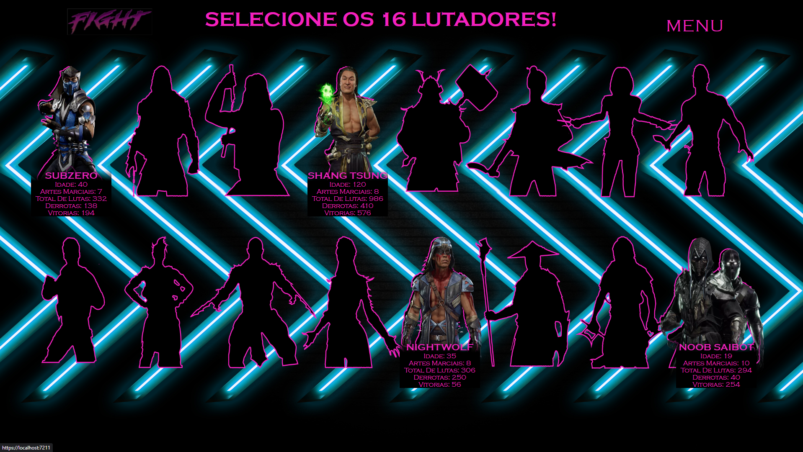

<h2 align="center" > Projeto Final -🥊 Torneio </h2>

<p align="center">Torneio referente a ultima semana do plano de estágio da T-Systems. Personagens do jogo de luta Mortal Kombat utilizados. </p> 
<h3 align="center">  </h3>


<!-- Sobre -->
<h2> Sobre o projeto: </h2>

Utilizei dos personagens de Mortal Kombat e da ideia solicitada pela regra de negócio pré determinada da semana para desenvolver o WEB APP. 
<h3> Imagem da tela de seleção</h3>


## Preparação

1º) Restaure o banco de dados, há um arquivo na pasta  'Data - arquivo .bak' utilizando o SQL Server MS.<br/>
2º) Altere a Connection string no metodo builder da  `Program.cs`, utilizando os dados do SQL Server, desta forma:

```csharp
builder.Services.AddEntityFrameworkSqlServer().AddDbContext<ContextoBase>
    (x => x.UseSqlServer("Server=<Nome_do_servidor>; Database = DB_Lutadores; Integrated Security = True; TrustServerCertificate = True"));
  
Exemplo:

builder.Services.AddEntityFrameworkSqlServer().AddDbContext<ContextoBase>
    (x => x.UseSqlServer("Server = CTS1A519661\\SQLEXPRESS; Database = DB_Lutadores; Integrated Security = True; TrustServerCertificate = True"));

```
3º) Após clonar o projeto na máquina local, abra o projeto com o Visual Studio e execute.


</p>

<h2 align="left"> Ferramentas e tecnologias usadas:</h2>
<p align="left"> <a href="https://www.w3schools.com/cs/" target="_blank" rel="noreferrer">  </a> <a href="https://www.w3schools.com/css/" target="_blank" rel="noreferrer">  </a> <a href="https://www.w3.org/html/" target="_blank" rel="noreferrer">  </a> <a href="https://developer.mozilla.org/en-US/docs/Web/JavaScript" target="_blank" rel="noreferrer">  </a> </p>

